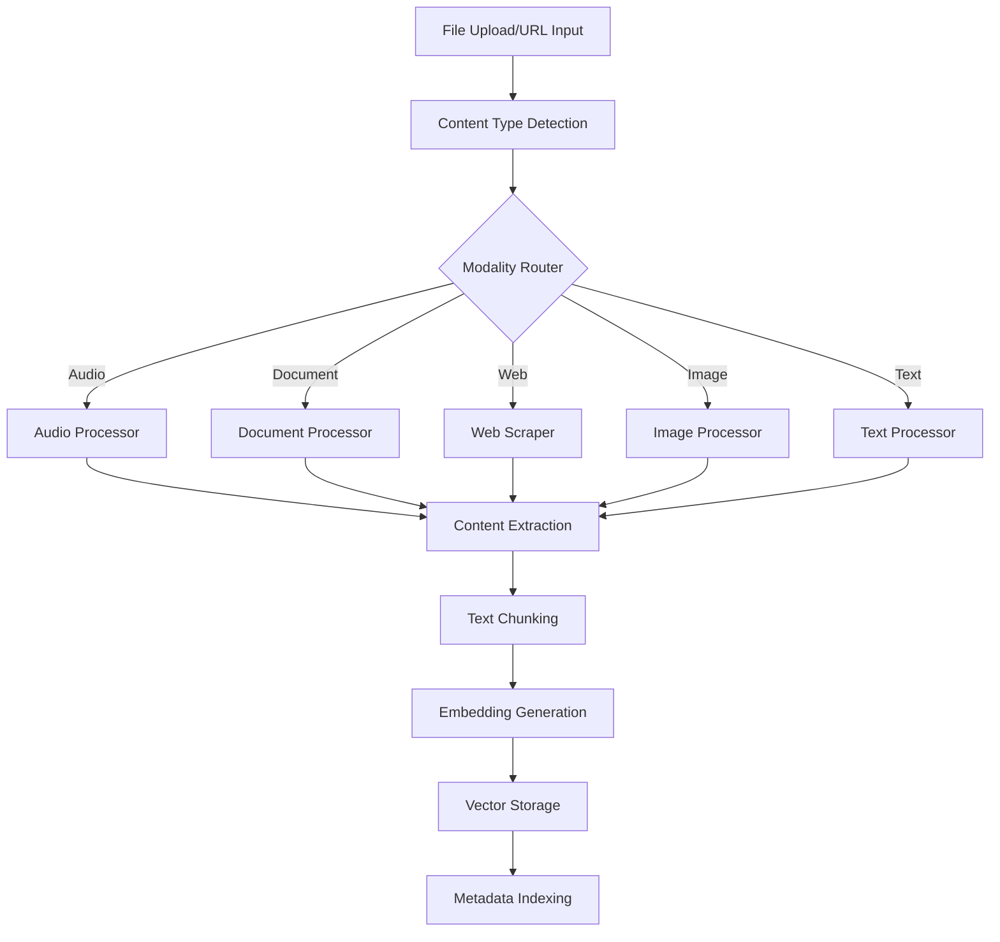

# Second Brain AI Companion - System Design Document

## Executive Summary

This document outlines the architecture for a "Second Brain" AI companion system that ingests, processes, and provides intelligent responses about multi-modal user data. The system is designed to handle audio, documents, web content, images, and plain text while providing fast, accurate, and contextual responses through natural language conversation.

## 1. Multi-Modal Data Ingestion Pipeline

### 1.1 Architecture Overview

The ingestion pipeline follows a modular, asynchronous architecture with dedicated processors for each data modality:

```
[Data Input] → [Modality Detector] → [Specific Processor] → [Content Extractor] → [Chunking Engine] → [Embedding Generator] → [Storage Layer]
```

### 1.2 Modality Processors

#### Audio Processing

- **Input**: .mp3, .m4a, .wav, .flac files
- **Technology**: OpenAI Whisper API for transcription
- **Process**:
  1. Audio file validation and format conversion
  2. Transcription with timestamp alignment
  3. Speaker diarization (when multiple speakers detected)
  4. Confidence scoring for transcription quality
- **Metadata**: Duration, file size, speaker count, confidence scores

#### Document Processing

- **Input**: .pdf, .md, .txt, .docx files
- **Technology**: PyPDF2/PDFPlumber for PDF, python-docx for Word
- **Process**:
  1. Text extraction with structure preservation
  2. Metadata extraction (author, creation date, page count)
  3. Table and image detection with OCR fallback
  4. Section/heading hierarchy preservation
- **Metadata**: Page count, author, creation date, document type

#### Web Content Processing

- **Input**: URLs
- **Technology**: BeautifulSoup4, Selenium for dynamic content
- **Process**:
  1. Content scraping with rate limiting
  2. HTML parsing and text extraction
  3. Link extraction and relationship mapping
  4. Image and media asset cataloging
- **Metadata**: URL, title, author, publish date, domain, outbound links

#### Image Processing

- **Input**: .jpg, .png, .gif, .webp files
- **Technology**: GPT-4 Vision API, OCR (Tesseract)
- **Process**:
  1. Visual content analysis and description generation
  2. Text extraction via OCR
  3. Object and scene recognition
  4. Thumbnail generation for quick reference
- **Metadata**: Dimensions, file size, detected objects, extracted text

#### Plain Text Processing

- **Input**: Raw text, notes
- **Process**:
  1. Language detection
  2. Structure analysis (paragraphs, lists, headers)
  3. Entity extraction (dates, names, locations)
- **Metadata**: Word count, language, structure type

### 1.3 Processing Pipeline Flow



## 2. Information Retrieval & Querying Strategy

### 2.1 Hybrid Search Approach

The system implements a sophisticated hybrid search combining multiple retrieval strategies:

#### Semantic Search (Primary)

- **Technology**: OpenAI text-embedding-3-large (3072 dimensions)
- **Implementation**: Dense vector retrieval using cosine similarity
- **Use Cases**: Conceptual queries, synonym matching, contextual understanding
- **Query Processing**: User query → embedding → vector similarity search

#### Keyword Search (Secondary)

- **Technology**: PostgreSQL Full-Text Search with tsvector
- **Implementation**: Inverted index with TF-IDF scoring
- **Use Cases**: Exact term matching, technical terminology, proper nouns
- **Features**: Stemming, stop word filtering, phrase matching

#### Graph-Based Relationships (Tertiary)

- **Technology**: Neo4j for entity relationships
- **Implementation**: Knowledge graph with entities, concepts, and relationships
- **Use Cases**: Complex relational queries, temporal connections
- **Features**: Entity linking, relationship traversal, path finding

### 2.2 Query Processing Pipeline

```
[User Query] → [Intent Classification] → [Query Expansion] → [Multi-Strategy Retrieval] → [Result Fusion] → [Relevance Ranking] → [Context Selection]
```

#### Query Enhancement Steps:

1. **Intent Classification**: Temporal, factual, conceptual, or procedural queries
2. **Query Expansion**: Synonym addition, related term inclusion
3. **Temporal Processing**: Date/time extraction and normalization
4. **Entity Extraction**: Named entity recognition for targeted search

#### Result Fusion Algorithm:

- Reciprocal Rank Fusion (RRF) for combining multiple search results
- Weighted scoring based on search strategy confidence
- Diversity injection to avoid redundant results

### 2.3 Retrieval Optimization

#### Caching Strategy:

- Query result caching with Redis (1-hour TTL)
- Embedding caching for frequently accessed content
- User-specific cache invalidation

#### Performance Optimization:

- Approximate Nearest Neighbor (ANN) search with HNSW indexing
- Query batching for related requests
- Asynchronous retrieval with result streaming

## 3. Data Indexing & Storage Model

### 3.1 Storage Architecture

#### Multi-Tier Storage Design:

```
[Application Layer] ← → [Caching Layer (Redis)] ← → [Primary Database (PostgreSQL)] ← → [Vector Database (Chroma)] ← → [Object Storage (S3)]
```

### 3.2 Database Schema

#### Primary Database (PostgreSQL)

```sql
-- Core content table
CREATE TABLE documents (
    id UUID PRIMARY KEY DEFAULT gen_random_uuid(),
    user_id UUID NOT NULL REFERENCES users(id),
    title VARCHAR(500),
    content_type VARCHAR(50) NOT NULL,
    source_path TEXT,
    file_size BIGINT,
    created_at TIMESTAMP WITH TIME ZONE DEFAULT NOW(),
    updated_at TIMESTAMP WITH TIME ZONE DEFAULT NOW(),
    metadata JSONB,
    content_hash VARCHAR(64) UNIQUE,
    processing_status VARCHAR(20) DEFAULT 'pending',
    CONSTRAINT valid_content_type CHECK (content_type IN ('audio', 'document', 'web', 'image', 'text'))
);

-- Content chunks for processing
CREATE TABLE content_chunks (
    id UUID PRIMARY KEY DEFAULT gen_random_uuid(),
    document_id UUID NOT NULL REFERENCES documents(id) ON DELETE CASCADE,
    chunk_index INTEGER NOT NULL,
    content TEXT NOT NULL,
    chunk_type VARCHAR(50),
    start_timestamp INTERVAL, -- for audio/video content
    end_timestamp INTERVAL,
    page_number INTEGER, -- for document content
    metadata JSONB,
    embedding_id VARCHAR(100), -- reference to vector DB
    created_at TIMESTAMP WITH TIME ZONE DEFAULT NOW(),
    CONSTRAINT unique_chunk_per_doc UNIQUE (document_id, chunk_index)
);

-- Full-text search index
CREATE INDEX idx_content_chunks_fts ON content_chunks USING gin(to_tsvector('english', content));

-- Temporal indexing
CREATE INDEX idx_documents_created_at ON documents(created_at);
CREATE INDEX idx_documents_user_created ON documents(user_id, created_at);
```

#### Vector Database Schema (Chroma)

```python
# Collection configuration
collection_config = {
    "name": "second_brain_embeddings",
    "metadata": {
        "hnsw:space": "cosine",
        "hnsw:construction_ef": 200,
        "hnsw:M": 16
    }
}

# Document structure in vector DB
vector_document = {
    "id": "chunk_uuid",
    "embedding": [float] * 3072,  # OpenAI embedding dimensions
    "metadata": {
        "document_id": "parent_document_uuid",
        "user_id": "user_uuid",
        "chunk_index": int,
        "content_type": str,
        "timestamp": "ISO_datetime",
        "source": str,
        "confidence_score": float
    },
    "document": "original_text_content"
}
```

### 3.3 Content Processing Lifecycle

#### Chunking Strategy:

1. **Semantic Chunking**: Preserve sentence and paragraph boundaries
2. **Sliding Window**: 500-token chunks with 100-token overlap
3. **Hierarchy Preservation**: Maintain document structure context
4. **Metadata Enrichment**: Add contextual information to each chunk

#### Indexing Process:

```
[Raw Content] → [Text Extraction] → [Semantic Chunking] → [Embedding Generation] → [Vector Storage] → [Metadata Indexing] → [Search Index Building]
```

### 3.4 Storage Trade-offs Analysis

#### PostgreSQL (Primary Database)

**Advantages:**

- ACID compliance for data consistency
- Rich query capabilities with JSON support
- Excellent full-text search with GIN indexes
- Proven scalability and reliability

**Trade-offs:**

- Higher storage costs for large text content
- Complex queries may impact performance at scale

#### Vector Database (Chroma)

**Advantages:**

- Optimized for similarity search
- Built-in embedding management
- Horizontal scalability
- Fast approximate search with HNSW

**Trade-offs:**

- Additional complexity in data synchronization
- Eventual consistency model
- Limited complex query capabilities

#### Object Storage (S3)

**Advantages:**

- Cost-effective for large files
- Virtually unlimited scalability
- Built-in redundancy and durability

**Trade-offs:**

- Higher latency for small file access
- Additional costs for frequent access patterns

## 4. Temporal Querying Support

### 4.1 Timestamp Architecture

#### Multi-Level Temporal Indexing:

1. **Document Level**: Creation, modification, and access timestamps
2. **Chunk Level**: Specific timestamps for audio segments, page references
3. **Event Level**: User interaction timestamps, query history

#### Temporal Data Model:

```sql
-- Enhanced temporal support
ALTER TABLE documents ADD COLUMN temporal_context JSONB;
ALTER TABLE content_chunks ADD COLUMN temporal_markers JSONB;

-- Temporal context examples:
-- Document level: {"created": "2024-01-15T10:30:00Z", "last_accessed": "2024-01-20T14:15:00Z"}
-- Chunk level: {"audio_start": "00:05:30", "audio_end": "00:05:45", "speaker": "John"}
```

### 4.2 Temporal Query Processing

#### Query Types Supported:

1. **Absolute Temporal**: "What did I save on January 15th?"
2. **Relative Temporal**: "What did I work on last month?"
3. **Duration-based**: "Show me content from the past week"
4. **Event-based**: "What was discussed in meetings last Tuesday?"

#### Implementation Strategy:

```python
class TemporalQueryProcessor:
    def parse_temporal_query(self, query: str) -> TemporalFilter:
        # Extract temporal expressions using spaCy NER
        # Convert natural language to datetime ranges
        # Handle relative references (last week, yesterday, etc.)
        pass

    def apply_temporal_filter(self, base_query: SearchQuery, temporal_filter: TemporalFilter) -> SearchQuery:
        # Modify search parameters to include time constraints
        # Adjust ranking to consider recency
        # Apply temporal context to vector search
        pass
```

### 4.3 Temporal Search Optimization

#### Indexing Strategy:

- B-tree indexes on timestamp columns for range queries
- Composite indexes on (user_id, timestamp) for user-specific temporal searches
- Partitioning by time periods for large datasets

#### Caching Strategy:

- Time-aware cache invalidation
- Separate cache namespaces for different temporal contexts
- Precomputed aggregations for common temporal queries

## 5. Scalability and Privacy

### 5.1 Scalability Architecture

#### Horizontal Scaling Strategy:

1. **Application Tier**: Stateless FastAPI services behind load balancer
2. **Database Tier**: Read replicas for query distribution
3. **Processing Tier**: Distributed task queue with Celery
4. **Vector Search**: Sharded vector collections by user segments

#### Performance Projections:

- **Single User**: 10,000+ documents, sub-second query response
- **Multi-User**: 1,000+ concurrent users with proper resource allocation
- **Storage**: Petabyte-scale with distributed storage architecture

#### Scaling Bottlenecks and Solutions:

1. **Embedding Generation**: Batch processing, GPU acceleration
2. **Vector Search**: Distributed index sharding, approximate search
3. **Database Queries**: Connection pooling, query optimization, caching

### 5.2 Privacy by Design

#### Data Isolation:

- **User-level Encryption**: AES-256 encryption with user-specific keys
- **Network Security**: TLS 1.3 for all data in transit
- **Access Controls**: Role-based access with JWT authentication

#### Privacy Architecture Options:

##### Option 1: Cloud-Hosted Solution

**Advantages:**

- Managed infrastructure and scaling
- Professional security management
- Cost-effective for most users

**Privacy Trade-offs:**

- Data processed by third-party services (OpenAI, etc.)
- Compliance requirements (GDPR, CCPA)
- Vendor lock-in concerns

##### Option 2: Local-First Architecture

**Advantages:**

- Complete data control and privacy
- No external API dependencies
- Compliance with strict privacy requirements

**Privacy Trade-offs:**

- Limited AI capabilities (smaller local models)
- Higher computational requirements
- Complex local setup and maintenance

#### Recommended Hybrid Approach:

1. **Sensitive Data**: Local processing with on-device models
2. **General Content**: Cloud processing with anonymization
3. **User Choice**: Granular privacy controls per document type
4. **Zero-Knowledge Architecture**: Client-side encryption before cloud storage

### 5.3 Privacy Controls Implementation

```python
class PrivacyManager:
    def classify_sensitivity(self, content: str) -> PrivacyLevel:
        # Detect PII, financial info, health data
        # Apply user-defined sensitivity rules
        # Return appropriate processing level
        pass

    def apply_privacy_policy(self, document: Document, policy: PrivacyPolicy) -> ProcessingPlan:
        # Determine local vs. cloud processing
        # Apply appropriate encryption levels
        # Set retention and deletion policies
        pass
```

## 6. Technology Stack

### 6.1 Backend Technologies

- **API Framework**: FastAPI with async support
- **Database**: PostgreSQL 15+ with vector extensions
- **Vector Database**: ChromaDB for embedding storage
- **Task Queue**: Celery with Redis broker
- **Caching**: Redis for session and query caching
- **AI/ML APIs**: OpenAI GPT-4 & Embeddings, Whisper
- **Web Scraping**: BeautifulSoup4, Selenium, Playwright

### 6.2 Frontend Technologies

- **Framework**: React 18 with TypeScript
- **State Management**: Zustand for global state
- **UI Components**: Tailwind CSS with Headless UI
- **Real-time**: WebSocket for streaming responses
- **File Upload**: React Dropzone with progress tracking

### 6.3 Infrastructure

- **Containerization**: Docker with multi-stage builds
- **Orchestration**: Docker Compose for development
- **Monitoring**: Prometheus + Grafana
- **Logging**: Structured logging with ELK stack
- **Deployment**: AWS/GCP with Terraform

## 7. API Design

### 7.1 Core Endpoints

```python
# Document ingestion
POST /api/v1/documents/upload
POST /api/v1/documents/web-scrape
POST /api/v1/documents/text

# Query interface
POST /api/v1/query/ask
GET /api/v1/query/history
WebSocket /api/v1/query/stream

# Document management
GET /api/v1/documents/
GET /api/v1/documents/{id}
DELETE /api/v1/documents/{id}
PUT /api/v1/documents/{id}/metadata
```

### 7.2 Real-time Query Streaming

```python
@app.websocket("/api/v1/query/stream")
async def query_stream(websocket: WebSocket):
    await websocket.accept()
    async for message in websocket.iter_text():
        query = json.loads(message)
        async for response_chunk in process_streaming_query(query):
            await websocket.send_json({
                "type": "response_chunk",
                "content": response_chunk,
                "timestamp": datetime.utcnow().isoformat()
            })
```

## 8. Security Considerations

### 8.1 Authentication & Authorization

- JWT-based authentication with refresh tokens
- Role-based access control (RBAC)
- API rate limiting and DDoS protection
- Input validation and sanitization

### 8.2 Data Security

- Encryption at rest and in transit
- Secure file upload with virus scanning
- SQL injection prevention
- XSS protection with CSP headers

## 9. Monitoring & Observability

### 9.1 Key Metrics

- Query response time and accuracy
- Document processing throughput
- System resource utilization
- User engagement and satisfaction

### 9.2 Alerting Strategy

- Performance degradation alerts
- Processing failure notifications
- Security incident detection
- Capacity planning triggers

## 10. Future Enhancements

### 10.1 Advanced Features

- Multi-user collaboration and sharing
- Advanced analytics and insights
- Integration with external tools (Notion, Slack, etc.)
- Mobile application development

### 10.2 AI Improvements

- Fine-tuned models for domain-specific content
- Advanced reasoning capabilities
- Multi-modal understanding improvements
- Personalized response generation

This architecture provides a robust, scalable, and privacy-conscious foundation for the Second Brain AI Companion system, with clear paths for future enhancement and scaling.
